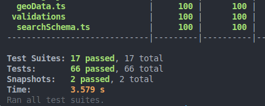
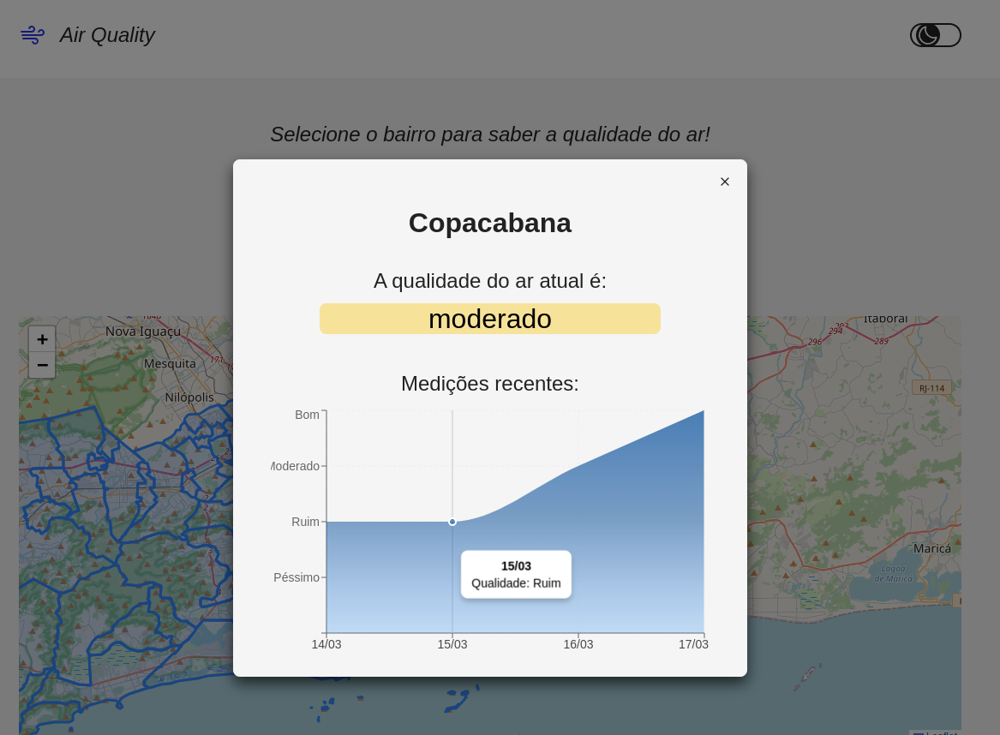
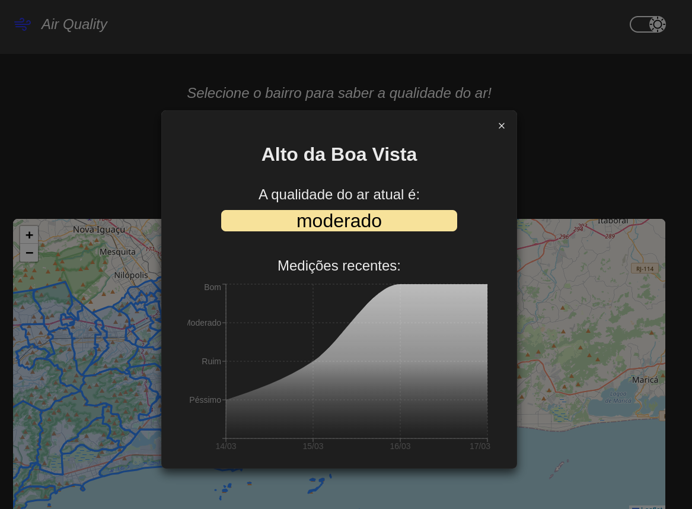
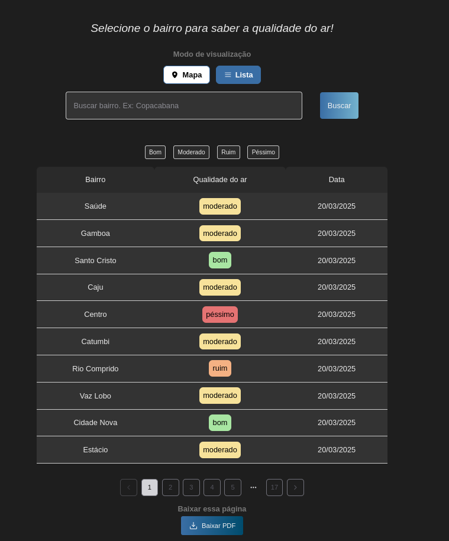
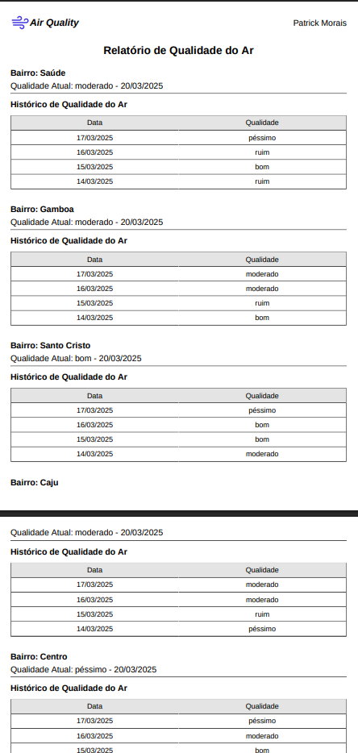
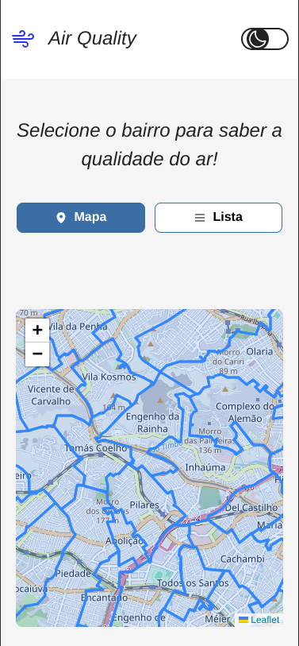

# 📌 Índice

1. [📖 Sobre o Projeto](#sobre-o-projeto)
2. [📌 Funcionalidades Principais](#funcionalidades)
3. [🖥️ Tecnologias Utilizadas](#tecnologias-utilizadas)
4. [🚀 Como Executar o Projeto](#como-executar-o-projeto)
   - Requisitos
   - Instalação
   - Rodando o Projeto
   - Rotas do Json-Server
   - Executando Testes Automatizados
5. [🗂️ Estrutura do Projeto](#estrutura-do-projeto)
   - Estrutura de Pastas
   - Decisões de implementação
6. [📷 Mídias e Funcionalidades](#mídias)
7. [👨‍💻 Autor](#%EF%B8%8F-autor)

---

# Sobre o Projeto

Air Quality Dashboard é um painel interativo permitindo monitoramento da qualidade do ar nos bairros da cidade. O projeto exibe os dados de forma clara oferecendo recursos como um mapa interativo, filtros e um histórico de medições.

<br />

---

## Funcionalidades

🌍 <b>Mapa Interativo:</b> Exibe a qualidade do ar por bairro, permitindo interação com os bairros.

📊 <b>Tabela de Dados:</b> Lista as medições recentes organizadas de forma acessível.

🎯 <b>Filtros:</b> Possibilidade de filtrar por bairro e níveis de qualidade do ar no modo lista.

📉 <b>Gráfico de Histórico:</b> Mostra a variação da qualidade do ar ao longo do tempo.

📥 <b>Download de Relatório:</b> Opção para baixar os dados filtrados em formato PDF.

---

# Tecnologias Utilizadas

O projeto foi desenvolvido utilizando algumas tecnologias modernas:

- <b>Next.js</b> - Framework React.

- <b>TypeScript</b> - Para tipagem segura e manutenção eficiente.

- <b>Chakra-UI</b> - Biblioteca de componentes acessíveis e estilizados, facilitando a construção de interfaces modernas e responsivas.

- <b>Leaflet</b> - Biblioteca para renderização do mapa interativo.

- <b>ReChart</b> - Para geração de gráficos.

- <b>React Hook Form + Zod</b> - Para validação e gerenciamento de formulários.

- <b>React-PDF</b> - Para geração de relatórios em PDF.

- <b>Styled Components</b> - Para estilização dos componentes dinâmicos.

- <b>Jest + Testing Library</b> - Para testes unitários e de integração.

- <b>Json Server</b> - Para simular uma API.

<br />
<br />

---

# Como Executar o Projeto

### 🔧 Requisitos

Esse projeto utiliza a versão `20.19.0` do Node, como está especificado no `.nvmrc`

`npm` ou `yarn`

### 📦 Instalação

1 - Clone este repositório:

```bash
git clone git@github.com:PatrickMoraisN/air-quality-dash.git
```

2 - Acesse o diretório do projeto:

```bash
cd air-quality-dash
```

3 - Utilize a versão correta do Node com o nvm da raíz do projeto:

```bash
nvm use
```

4 - Instale as dependências:

```bash
npm i
```

### ▶️ Rodando o Projeto

1 - Inicie o JSON SERVER para simular a API:

```bash
npm run server:dev
```

2 - Inicie o projeto em Next:

```bash
npm run dev
```

Pronto!

O projeto estará rodando em: http://localhost:3000/

O servidor estará rodando em: http://localhost:3001

#### Rotas do json-server:

`/bairros` - retorna todos os bairros. Paginação é feita no cliente.
`/bairros-total` - retorna o total dos items, devidos as limitações do json-server.

<br />

---

### 🧪 Executando os Testes

O projeto possui cobertura de testes para componentes e serviços:



<b>Rodando testes:</b>

```bash
npm run test
```

<b>Modo Coverage</b>:

```bash
npm run test:coverage
```

---

# Estrutura do Projeto

## Pastas

```
src
├── app
├── assets
├── components
│ ├── Component
│ │ ├── **tests**
│ │ ├── sub-components
├── context
├── hooks
│ ├── **tests**
├── layouts
├── routes
├── services
│ ├── **tests**
│ ├── airQuality
│ ├── common
│ ├── geoData
├── styles
├── types
├── utils
│ ├── **tests**
├── validations
```

## 📜 Decisões de Implementação

### 📌 Uso de React Hook Form + Zod

React Hook Form foi escolhido para melhor performance em formulários e pelo Zod para validação declarativa e segura.

### 📌 Gerenciamento de Estado Simples

Como é um projeto de escopo reduzido, não foi pensado em introduzir Redux ou Context API desnecessariamente.

### 📌 Geração de PDFs com React-PDF

React-PDF para permitir download da tabela filtrada, com um layout organizado e contendo a logo e autor do relatório.

### 📌 Geração Gráficos

Recharts para renderizar gráficos dinâmicos e modernos.

### 📌 Estrutura Modularizada

Componentes bem organizados e reutilizáveis, favorecendo a manutenção e escalabilidade do código.

### 📌 Acessibilidade e estilos

- Dark Theme e Light Theme.
- Styled-Components para diversas props dinâmicas e interação com contexto global de tema.
- Chakra-UI foi escolhido por ter componentes acessíveis e permitindo boa estilização e interação com styled-components

### 📌 Testes Automatizados

Testes para garantir a confiabilidade da aplicação. Os principais testes cobrem:

- Renderização de componentes.
- Interação com botões e filtros.
- Geração do PDF.
- Chamadas de API.

# Mídias e Funcionalidades

### Mapa Iterativo

- Mapa Iterativo com bairros marcados por GeoJSON


### Dark Mode e Light Mode

- Estilos e temas globais com Styled-Components




### Tabela Iterativa




### Geração de PDF da página

- Gera PDF do resultado atual, incluindo filtros feitos.



### Responsividade

-

<h3>Veja o vídeo:</h3>
<a href="https://www.youtube.com/watch?v=j5Cnig9KtC4" target="_blank">
  
</a>

<h3>Veja o vídeo:</h3>
<a href="https://www.youtube.com/watch?v=8UcSAFTD2WI" target="_blank">
  
</a>

<h3>Veja o vídeo:</h3>
<a href="https://www.youtube.com/watch?v=oH1ViOkTTBs" target="_blank">
  
</a>

<h3>Veja o vídeo:</h3>
<a href="https://www.youtube.com/watch?v=4QxcomY7s4Y" target="_blank">
  
</a>



